# Use Case Modelling
## Web Riza Apparel — Fase MMP (Minimum Marketable Product)

| | |
|---|---|
| **Produk** | Landing page, AI chatbot, dan Design Studio kustomisasi jersey untuk Riza Apparel |
| **Klien** | Riza Apparel — produsen custom jersey & sportswear, Ende, Nusa Tenggara Timur |
| **URL MVP** | https://rizaapparel-2026.web.app/ |
| **Dokumen rujukan** | Cause and Effect Analysis, System Improvement Objectives, PIECES Classification, Product Requirements Document |
| **Isi dokumen** | (1) Actors Table, (2) Identifying Business Requirements Use Case, (3) Actor Glossary, (4) Use Case Glossary, (5) Use-Case Model Diagram, (6) Use-Case Entity Glossary |

---

## 1. Actors Table

| Actor Categories | Actors | Explanation |
|---|---|---|
| **Primary Business Actor** | Calon Pelanggan (Pemesan Tim/Komunitas) | Pengurus tim futsal, klub olahraga, atau panitia turnamen yang memulai use case inti: menjelajahi katalog, menggunakan Design Studio, meminta estimasi harga, dan mengirimkan permintaan penawaran. Actor ini memberi nilai bisnis paling besar karena volume pesanannya cenderung besar. |
| **Primary Business Actor** | Calon Pelanggan (Pemesan Individu) | Individu yang memesan jersey custom dalam jumlah kecil atau untuk kebutuhan pribadi. Memulai use case yang sama dengan Pemesan Tim, namun dengan pola interaksi kuantitas kecil pada estimator harga. |
| **Primary Business Actor** | Admin/Pemilik Riza Apparel | Pengelola bisnis yang memulai use case pengelolaan konten (CMS), pemantauan prospek masuk (CRM), dan pembaruan status pesanan. Berperan sebagai actor di sisi penyedia layanan, bukan konsumen. |
| **Secondary Business Actor** | Pelanggan yang Sudah Memesan | Pelanggan yang telah melewati tahap prospek dan memiliki pesanan aktif; memulai use case memeriksa status pesanan melalui tautan unik, tanpa terlibat dalam use case akuisisi awal. |
| **Primary System Actor** | Design Studio Engine | Komponen sistem yang dipicu oleh input pengguna (drag, resize, pemilihan motif/font) untuk merender pratinjau desain jersey secara real-time; bertindak sebagai actor sistem yang menjalankan use case kustomisasi atas nama pengguna. |
| **Primary System Actor** | AI Chatbot Engine | Komponen sistem yang menerima pertanyaan pengguna, melakukan pencarian pada knowledge base, dan menghasilkan jawaban; dipicu setiap kali pengguna mengirim pesan pada widget chat. |
| **External Server Actor** | Search Engine Crawler (Googlebot dan sejenisnya) | Sistem eksternal yang mengunjungi dan mengindeks halaman situs secara berkala; bergantung pada use case rendering konten (SSR/prerender) agar dapat membaca konten secara utuh. |
| **External Server Actor** | Penyedia Layanan AI Generatif | Layanan pihak ketiga (LLM/model generatif) yang dipanggil oleh AI Chatbot Engine dan AI Design Generator untuk menghasilkan jawaban maupun gambar desain; beroperasi dalam batas kuota tier gratis. |
| **External Server Actor** | WhatsApp | Platform pesan eksternal yang menerima pesan prasi (pre-filled message) dari tombol CTA situs, menjadi kanal tindak lanjut utama antara calon pelanggan dan admin. |
| **External Server Actor** | Google Analytics (GA4) | Layanan eksternal yang menerima event pelacakan dari situs (kunjungan Studio, desain selesai, lead terkirim) untuk keperluan pengukuran funnel. |
| **External Server Actor** | Google Fonts | Layanan eksternal yang menyediakan pustaka font tambahan yang dimuat oleh Design Studio saat pengguna memilih tipografi di luar set default. |
| **Receiving Actor** | Basis Data Prospek & Pesanan (CRM) | Penyimpanan yang menerima dan menampung data hasil dari use case lead capture dan pembaruan status pesanan, untuk kemudian dikonsumsi kembali oleh Admin pada use case pemantauan. |

---

## 2. Identifying Business Requirements Use Case

Lima pertanyaan berikut dijawab untuk setiap actor pada Actors Table, menjadi dasar penurunan daftar use case pada bagian berikutnya.

### 2.1 Calon Pelanggan (Pemesan Tim/Komunitas)

**1. Apa tugas utama actor ini?**
Menjelajahi katalog dan portofolio Riza Apparel, mempelajari bahan dan proses produksi, membuka Design Studio untuk mengustomisasi desain jersey tim (warna, motif, logo, nama dan nomor punggung), memperoleh estimasi harga berdasarkan jumlah pesanan, dan mengirimkan permintaan penawaran atau menghubungi admin via WhatsApp untuk menindaklanjuti pesanan.

**2. Informasi apa yang dibutuhkan actor ini dari sistem?**
Katalog produk dan pilihan bahan; pratinjau visual desain secara real-time selama proses kustomisasi; kisaran harga berdasarkan jumlah dan kompleksitas desain; size chart dengan ukuran aktual; estimasi lead time produksi; portofolio dan testimoni pesanan terdahulu sebagai bukti kualitas; status ketersediaan slot produksi bila relevan.

**3. Informasi apa yang diberikan actor ini kepada sistem?**
Pilihan warna, motif, dan tata letak logo pada Design Studio; teks nama dan nomor punggung per pemain; jumlah pesanan yang direncanakan; data kontak (nama, nomor WhatsApp, nama tim/instansi) saat mengisi formulir permintaan penawaran; opsional: gambar referensi desain dan prompt teks bila menggunakan AI design generator.

**4. Apakah sistem perlu menginformasikan actor ini atas perubahan atau kejadian yang terjadi?**
Ya — sistem perlu menampilkan konfirmasi setelah desain berhasil disimpan atau permintaan penawaran terkirim; menampilkan pesan kesalahan yang jelas bila AI design generator gagal menghasilkan gambar atau kuota AI sedang habis; menampilkan pembaruan status pesanan (Diterima → Diproduksi → Selesai) apabila actor ini kemudian menjadi Pelanggan yang Sudah Memesan.

**5. Apakah actor ini perlu menginformasikan sistem atas perubahan atau kejadian yang terjadi?**
Ya — actor perlu memberi tahu sistem saat memutuskan menyelesaikan sesi desain (memicu tampilnya CTA lanjutan), saat mengirimkan formulir lead capture, dan saat memilih untuk beralih dari kustomisasi manual ke penggunaan AI design generator (atau sebaliknya).

### 2.2 Calon Pelanggan (Pemesan Individu)

**1. Apa tugas utama actor ini?**
Pada dasarnya sama dengan Pemesan Tim/Komunitas — menjelajahi katalog, menggunakan Design Studio, memperoleh estimasi harga, dan menghubungi admin — namun dengan skala interaksi yang lebih kecil (satu atau beberapa potong jersey untuk kebutuhan pribadi).

**2. Informasi apa yang dibutuhkan actor ini dari sistem?**
Sama dengan Pemesan Tim, ditambah kejelasan apakah Riza Apparel melayani pesanan dalam jumlah kecil (di bawah minimum order tim), dan estimasi harga yang secara spesifik mencakup skenario kuantitas satuan.

**3. Informasi apa yang diberikan actor ini kepada sistem?**
Sama dengan Pemesan Tim — pilihan kustomisasi desain, data kontak, dan jumlah pesanan (umumnya 1) — tanpa kebutuhan input nama/nomor punggung per banyak pemain.

**4. Apakah sistem perlu menginformasikan actor ini atas perubahan atau kejadian yang terjadi?**
Ya — sama seperti Pemesan Tim: konfirmasi pengiriman, pesan kesalahan AI, dan pembaruan status pesanan. Tambahan: sistem sebaiknya secara eksplisit menginformasikan bila kuantitas kecil dikenakan biaya per unit yang berbeda dari harga grosir tim.

**5. Apakah actor ini perlu menginformasikan sistem atas perubahan atau kejadian yang terjadi?**
Ya — sama seperti Pemesan Tim: penyelesaian sesi desain dan pengiriman formulir permintaan penawaran.

### 2.3 Admin/Pemilik Riza Apparel

**1. Apa tugas utama actor ini?**
Mengelola konten situs (teks, gambar, katalog, promo, pustaka motif) melalui panel admin; memantau prospek yang masuk dari lead capture; menindaklanjuti prospek via WhatsApp; memperbarui status pesanan yang sedang berjalan; meninjau performa situs melalui data analitik; sesekali menambahkan materi baru ke knowledge base chatbot berdasarkan pertanyaan pelanggan yang belum terjawab.

**2. Informasi apa yang dibutuhkan actor ini dari sistem?**
Daftar prospek terbaru beserta detail kontak dan desain yang menyertainya; ringkasan metrik funnel (jumlah kunjungan Studio, desain selesai, lead masuk); status penggunaan kuota AI (agar tahu kapan mendekati batas tier gratis); daftar pesanan aktif beserta statusnya masing-masing; notifikasi bila ada prospek baru masuk.

**3. Informasi apa yang diberikan actor ini kepada sistem?**
Pembaruan teks/gambar/katalog produk melalui panel CMS; penambahan atau pengeditan motif pada pustaka Design Studio; perubahan status pesanan (mis. dari "Diterima" menjadi "Diproduksi"); entri baru untuk knowledge base chatbot; kredensial login admin untuk mengakses panel.

**4. Apakah sistem perlu menginformasikan actor ini atas perubahan atau kejadian yang terjadi?**
Ya — sistem perlu memberi tahu admin saat ada prospek baru masuk, saat kuota AI mendekati atau mencapai batas tier gratis (agar admin dapat mengantisipasi fitur AI dinonaktifkan sementara), dan saat perubahan konten berhasil atau gagal disimpan.

**5. Apakah actor ini perlu menginformasikan sistem atas perubahan atau kejadian yang terjadi?**
Ya — admin perlu memberi tahu sistem setiap kali status pesanan berubah agar pelanggan dapat melihat pembaruan tersebut, dan setiap kali konten atau motif baru siap dipublikasikan (bukan hanya disimpan sebagai draf).

### 2.4 Pelanggan yang Sudah Memesan

**1. Apa tugas utama actor ini?**
Memeriksa status pesanan yang sedang berjalan melalui tautan unik yang diberikan setelah pesanan dikonfirmasi, tanpa perlu menghubungi admin secara berulang.

**2. Informasi apa yang dibutuhkan actor ini dari sistem?**
Status pesanan terkini (mis. Diterima, Diproduksi, Selesai), ringkasan detail pesanan (jumlah, desain terkait bila relevan), dan estimasi waktu penyelesaian.

**3. Informasi apa yang diberikan actor ini kepada sistem?**
Tidak ada input substantif — actor ini bersifat pasif dan hanya mengakses tautan unik yang telah diberikan; paling banter memberikan tautan/kode pesanan sebagai kunci akses.

**4. Apakah sistem perlu menginformasikan actor ini atas perubahan atau kejadian yang terjadi?**
Ya — inilah use case inti actor ini: sistem menampilkan status pesanan terbaru setiap kali admin memperbaruinya, sehingga pelanggan tidak perlu bertanya secara manual.

**5. Apakah actor ini perlu menginformasikan sistem atas perubahan atau kejadian yang terjadi?**
Tidak — pada cakupan MMP, actor ini tidak memiliki kebutuhan menulis balik ke sistem (mis. konfirmasi penerimaan barang, revisi desain) di luar percakapan manual dengan admin via WhatsApp.

### 2.5 Design Studio Engine (System Actor)

**1. Apa tugas utama actor ini?**
Merender pratinjau desain jersey secara real-time berdasarkan input pengguna (warna, motif, font, posisi logo, nama/nomor), serta menghasilkan berkas ekspor siap cetak saat pengguna menyelesaikan desain.

**2. Informasi apa yang dibutuhkan actor ini dari sistem (komponen lain)?**
Aset jersey dasar (blank mockup 2D/3D) dan pustaka motif dari CMS; daftar font yang tersedia, termasuk yang dimuat dari Google Fonts.

**3. Informasi apa yang diberikan actor ini kepada sistem (komponen lain)?**
Berkas hasil desain (untuk disimpan sebagai lampiran prospek) dan data event penggunaan (mis. "desain dimulai", "desain selesai") untuk dikirim ke modul analitik.

**4. Apakah sistem (komponen lain) perlu menginformasikan actor ini atas perubahan atau kejadian yang terjadi?**
Ya — CMS perlu memberi tahu Design Studio Engine bila ada motif baru yang dipublikasikan atau motif lama yang dinonaktifkan, agar pustaka pilihan selalu sinkron.

**5. Apakah actor ini perlu menginformasikan sistem (komponen lain) atas perubahan atau kejadian yang terjadi?**
Ya — Design Studio Engine perlu memberi tahu modul CRM/lead capture setiap kali sebuah sesi desain selesai, agar dapat dilampirkan pada data prospek yang bersangkutan.

### 2.6 AI Chatbot Engine (System Actor)

**1. Apa tugas utama actor ini?**
Menerima pertanyaan pengguna melalui widget chat, mencari jawaban relevan dari knowledge base terstruktur, memanggil Penyedia Layanan AI Generatif untuk menyusun jawaban, dan mengembalikan respons ke pengguna.

**2. Informasi apa yang dibutuhkan actor ini dari sistem (komponen lain)?**
Knowledge base terkini yang dikelola admin; status kuota AI yang tersisa dari Penyedia Layanan AI Generatif.

**3. Informasi apa yang diberikan actor ini kepada sistem (komponen lain)?**
Log pertanyaan yang tidak terjawab dengan baik (untuk ditinjau admin sebagai bahan pembaruan knowledge base); data penggunaan kuota AI per sesi ke modul pengendalian kuota.

**4. Apakah sistem (komponen lain) perlu menginformasikan actor ini atas perubahan atau kejadian yang terjadi?**
Ya — modul pengendalian kuota perlu memberi tahu Chatbot Engine bila kuota gratis telah habis, agar chatbot beralih ke mode nonaktif/pesan pembatasan alih-alih memanggil API berbayar.

**5. Apakah actor ini perlu menginformasikan sistem (komponen lain) atas perubahan atau kejadian yang terjadi?**
Ya — Chatbot Engine perlu melaporkan setiap pemanggilan API ke modul pemantauan kuota agar penghitungan penggunaan tetap akurat dan real-time.

### 2.7 Search Engine Crawler (External Server Actor)

**1. Apa tugas utama actor ini?**
Mengunjungi rute-rute publik situs secara berkala untuk membaca dan mengindeks kontennya ke dalam basis data mesin pencari.

**2. Informasi apa yang dibutuhkan actor ini dari sistem?**
HTML bermuatan konten penuh tanpa memerlukan eksekusi JavaScript; metadata unik per halaman; berkas `sitemap.xml` dan `robots.txt`; structured data Schema.org.

**3. Informasi apa yang diberikan actor ini kepada sistem?**
Tidak ada input substantif ke sistem — actor ini murni bersifat membaca (read-only).

**4. Apakah sistem perlu menginformasikan actor ini atas perubahan atau kejadian yang terjadi?**
Secara tidak langsung ya — `sitemap.xml` perlu mencerminkan halaman baru atau yang diperbarui sehingga crawler mengetahui perlu mengindeks ulang.

**5. Apakah actor ini perlu menginformasikan sistem atas perubahan atau kejadian yang terjadi?**
Tidak berlaku secara langsung — status indeksasi dipantau oleh Admin melalui Google Search Console sebagai sistem terpisah, bukan komunikasi langsung dari crawler ke sistem Riza Apparel.

### 2.8 Penyedia Layanan AI Generatif (External Server Actor)

**1. Apa tugas utama actor ini?**
Memproses permintaan dari Chatbot Engine dan Design Studio Engine (AI design generator), lalu mengembalikan hasil berupa teks jawaban atau gambar desain.

**2. Informasi apa yang dibutuhkan actor ini dari sistem?**
Prompt terstruktur dari sistem (pertanyaan pengguna atau instruksi desain beserta gambar referensi); kredensial API yang dikirim dari backend.

**3. Informasi apa yang diberikan actor ini kepada sistem?**
Hasil jawaban chatbot atau gambar desain yang dihasilkan; status penggunaan kuota tier gratis saat ini.

**4. Apakah sistem perlu menginformasikan actor ini atas perubahan atau kejadian yang terjadi?**
Tidak secara langsung — interaksi bersifat request-response standar; tidak ada kebutuhan notifikasi proaktif dari sistem Riza Apparel ke penyedia layanan ini di luar permintaan API itu sendiri.

**5. Apakah actor ini perlu menginformasikan sistem atas perubahan atau kejadian yang terjadi?**
Ya — penyedia layanan perlu mengembalikan sinyal error atau status kuota terlampaui (mis. HTTP 429) yang harus ditangkap sistem untuk memicu penutupan otomatis fitur AI.

### 2.9 WhatsApp (External Server Actor)

**1. Apa tugas utama actor ini?**
Menerima pesan yang dikirim melalui tautan `wa.me` yang diklik oleh calon pelanggan, membawa pesan prasi berisi ringkasan konteks (desain atau kunjungan) ke nomor admin Riza Apparel.

**2. Informasi apa yang dibutuhkan actor ini dari sistem?**
Nomor tujuan admin dan teks pesan prasi (pre-filled) yang telah disusun sistem berdasarkan konteks pengguna.

**3. Informasi apa yang diberikan actor ini kepada sistem?**
Tidak ada — WhatsApp beroperasi sepenuhnya di luar sistem Riza Apparel setelah tautan diklik; tidak ada data yang dikembalikan ke situs.

**4. Apakah sistem perlu menginformasikan actor ini atas perubahan atau kejadian yang terjadi?**
Tidak berlaku — komunikasi bersifat satu arah dari situs ke WhatsApp melalui tautan, tanpa saluran umpan balik terintegrasi pada cakupan MMP.

**5. Apakah actor ini perlu menginformasikan sistem atas perubahan atau kejadian yang terjadi?**
Tidak berlaku pada cakupan MMP — integrasi WhatsApp Business API dua arah (mis. status pesan terbaca) berada di luar ruang lingkup dan dicatat sebagai potensi pengembangan lanjutan.

### 2.10 Google Analytics (GA4) (External Server Actor)

**1. Apa tugas utama actor ini?**
Menerima dan mengagregasi event yang dikirim dari situs untuk menghasilkan laporan funnel dan perilaku pengguna yang dapat ditinjau Admin.

**2. Informasi apa yang dibutuhkan actor ini dari sistem?**
Event terstruktur (nama event, parameter terkait) yang dikirim pada titik-titik funnel yang telah ditentukan: kunjungan Studio, desain dimulai, desain selesai, lead terkirim, klik WhatsApp.

**3. Informasi apa yang diberikan actor ini kepada sistem?**
Tidak langsung ke sistem situs — data laporan diakses Admin melalui dasbor GA4 terpisah, bukan dikembalikan ke dalam situs Riza Apparel.

**4. Apakah sistem perlu menginformasikan actor ini atas perubahan atau kejadian yang terjadi?**
Ya — inilah fungsi utamanya: setiap kejadian funnel yang relevan wajib dikirim sebagai event secara konsisten agar laporan akurat.

**5. Apakah actor ini perlu menginformasikan sistem atas perubahan atau kejadian yang terjadi?**
Tidak berlaku pada cakupan MMP — tidak ada kebutuhan data mengalir kembali dari GA4 ke dalam logika situs.

### 2.11 Google Fonts (External Server Actor)

**1. Apa tugas utama actor ini?**
Menyediakan berkas font yang diminta oleh Design Studio Engine saat pengguna memilih tipografi di luar set default yang sudah dimuat secara lokal.

**2. Informasi apa yang dibutuhkan actor ini dari sistem?**
Permintaan HTTP yang menyebutkan nama font dan gaya (weight/style) yang dibutuhkan.

**3. Informasi apa yang diberikan actor ini kepada sistem?**
Berkas font (format WOFF2) yang diminta.

**4. Apakah sistem perlu menginformasikan actor ini atas perubahan atau kejadian yang terjadi?**
Tidak berlaku — interaksi bersifat permintaan berkas statis tanpa negosiasi state.

**5. Apakah actor ini perlu menginformasikan sistem atas perubahan atau kejadian yang terjadi?**
Tidak berlaku — namun sistem perlu menangani kegagalan pemuatan (mis. offline) dengan fallback ke font sistem, sebagai bagian dari penanganan state antarmuka.

### 2.12 Basis Data Prospek & Pesanan / CRM (Receiving Actor)

**1. Apa tugas utama actor ini?**
Menyimpan data prospek dari lead capture dan data status pesanan, serta menyediakannya kembali saat diminta oleh Admin (panel pemantauan) atau Pelanggan yang Sudah Memesan (halaman status).

**2. Informasi apa yang dibutuhkan actor ini dari sistem (komponen lain)?**
Data terstruktur yang dikirim dari formulir lead capture dan dari pembaruan status yang dilakukan Admin.

**3. Informasi apa yang diberikan actor ini kepada sistem (komponen lain)?**
Daftar prospek dan status pesanan saat diminta oleh panel Admin; data status pesanan tunggal saat diminta oleh halaman pelacakan pelanggan.

**4. Apakah sistem (komponen lain) perlu menginformasikan actor ini atas perubahan atau kejadian yang terjadi?**
Ya — Design Studio Engine dan formulir lead capture perlu menuliskan data baru ke basis data ini setiap kali terjadi sesi desain selesai atau prospek baru masuk.

**5. Apakah actor ini perlu menginformasikan sistem (komponen lain) atas perubahan atau kejadian yang terjadi?**
Ya — basis data perlu memicu notifikasi ke Admin (mis. lewat panel atau email/WhatsApp) setiap kali ada entri prospek baru tersimpan, agar tindak lanjut tidak tertunda.

---

## 3. Actor Glossary

| Term | Synonym | Description |
|---|---|---|
| Calon Pelanggan (Pemesan Tim/Komunitas) | Pemesan Tim, Klien Tim, Team Buyer | Pengurus tim futsal, klub olahraga sekolah, atau panitia turnamen yang mengunjungi situs untuk menjelajahi katalog, menggunakan Design Studio, memperoleh estimasi harga, dan mengajukan permintaan penawaran untuk pesanan jersey dalam jumlah besar (umumnya 10 potong atau lebih). |
| Calon Pelanggan (Pemesan Individu) | Pemesan Perorangan, Klien Individu, Individual Buyer | Individu yang mengunjungi situs untuk memesan custom jersey dalam jumlah kecil atau satuan, mengikuti alur interaksi yang sama dengan Pemesan Tim namun pada skala kuantitas yang lebih kecil. |
| Admin/Pemilik Riza Apparel | Admin, Pemilik Usaha, Pengelola Bisnis, Business Owner | Pihak internal Riza Apparel yang mengelola konten situs melalui panel CMS, memantau dan menindaklanjuti prospek dari CRM, serta memperbarui status pesanan yang sedang berjalan. |
| Pelanggan yang Sudah Memesan | Pelanggan Aktif, Pemesan Terkonfirmasi, Existing Customer | Pelanggan yang telah melewati tahap prospek dan memiliki pesanan aktif, mengakses situs khusus untuk memeriksa status pesanan melalui tautan unik yang diberikan. |
| Design Studio Engine | Mesin Studio, Modul Kustomisasi Desain, Studio Rendering Engine | Komponen sistem yang merender pratinjau desain jersey secara real-time berdasarkan input pengguna dan menghasilkan berkas ekspor siap cetak saat sesi desain selesai. |
| AI Chatbot Engine | Mesin Chatbot, Asisten Virtual, Chat Assistant | Komponen sistem yang menerima pertanyaan pengguna melalui widget chat, mencari jawaban dari knowledge base, dan memanggil layanan AI generatif untuk menyusun respons. |
| Search Engine Crawler | Web Crawler, Googlebot, Bot Pengindeks | Sistem eksternal milik mesin pencari yang mengunjungi rute publik situs secara berkala untuk membaca dan mengindeks kontennya. |
| Penyedia Layanan AI Generatif | AI Provider, Layanan Model Bahasa, LLM Provider | Layanan pihak ketiga yang memproses permintaan dari Chatbot Engine dan Design Studio Engine, mengembalikan hasil berupa teks jawaban atau gambar desain, beroperasi dalam batas kuota tier gratis. |
| WhatsApp | WA, Kanal Pesan, Messaging Channel | Platform pesan eksternal yang menerima pesan prasi dari tombol CTA situs, menjadi kanal komunikasi utama antara calon pelanggan dan admin untuk tindak lanjut manual. |
| Google Analytics (GA4) | GA4, Modul Analitik, Analytics Platform | Layanan eksternal yang menerima dan mengagregasi event pelacakan dari situs untuk menghasilkan laporan funnel dan perilaku pengguna. |
| Google Fonts | Pustaka Font Eksternal, Web Font Service | Layanan eksternal yang menyediakan berkas font tambahan yang dimuat oleh Design Studio Engine saat pengguna memilih tipografi di luar set default. |
| Basis Data Prospek & Pesanan (CRM) | CRM, Repositori Prospek, Lead & Order Database | Penyimpanan sistem yang menampung data hasil lead capture dan status pesanan, dikonsumsi kembali oleh Admin (panel pemantauan) dan Pelanggan yang Sudah Memesan (halaman status). |

---

## 4. Use Case Glossary

| Use Case Name | Use Case Description | Participating Actors and Roles |
|---|---|---|
| Menjelajahi Katalog & Portofolio | Pengguna menelusuri halaman produk, katalog bahan, dan galeri portofolio pesanan terdahulu untuk memahami penawaran Riza Apparel sebelum melanjutkan ke tahap kustomisasi atau kontak. | **Calon Pelanggan (Pemesan Tim/Komunitas)** — inisiator; **Calon Pelanggan (Pemesan Individu)** — inisiator. |
| Melihat Sinyal Kepercayaan | Pengguna meninjau konten pendukung keputusan pembelian: testimoni klien, size chart dengan ukuran aktual, estimasi lead time, dan skema pembayaran/DP. | **Calon Pelanggan (Pemesan Tim/Komunitas)** — inisiator; **Calon Pelanggan (Pemesan Individu)** — inisiator. |
| Memperoleh Estimasi Harga | Pengguna menggunakan kalkulator interaktif untuk mendapatkan kisaran harga berdasarkan jumlah pesanan, jenis bahan, dan tingkat kompleksitas desain, tanpa perlu menghubungi admin terlebih dahulu. | **Calon Pelanggan (Pemesan Tim/Komunitas)** — inisiator; **Calon Pelanggan (Pemesan Individu)** — inisiator. |
| Mengustomisasi Desain Jersey Manual | Pengguna memilih warna, motif, font, dan posisi logo, serta memasukkan nama dan nomor punggung secara manual melalui perkakas kanvas Design Studio. | **Calon Pelanggan (Pemesan Tim/Komunitas)** — inisiator; **Calon Pelanggan (Pemesan Individu)** — inisiator; **Design Studio Engine** — pendukung (merender interaksi). |
| Menggunakan AI Design Generator | Pengguna mengunggah gambar referensi dan menuliskan prompt teks untuk menghasilkan desain jersey secara otomatis sebagai alternatif dari kustomisasi manual. | **Calon Pelanggan (Pemesan Tim/Komunitas)** — inisiator; **Calon Pelanggan (Pemesan Individu)** — inisiator; **Design Studio Engine** — pendukung; **Penyedia Layanan AI Generatif** — pemroses eksternal. |
| Merender Pratinjau Desain Real-time | Sistem menampilkan hasil visual dari setiap perubahan yang dilakukan pengguna pada kanvas desain secara langsung, baik dari jalur manual maupun hasil AI generator. | **Design Studio Engine** — pelaksana; **Calon Pelanggan (Pemesan Tim/Komunitas)** — penerima manfaat; **Calon Pelanggan (Pemesan Individu)** — penerima manfaat. |
| Menghasilkan Berkas Ekspor Siap Cetak | Sistem mengonversi desain yang telah disetujui pengguna menjadi berkas beresolusi cetak dengan bleed dan kelonggaran jahitan sesuai standar produksi sublimasi. | **Design Studio Engine** — pelaksana; **Admin/Pemilik Riza Apparel** — penerima manfaat (untuk keperluan produksi). |
| Mengirim Permintaan Penawaran (Lead Capture) | Pengguna mengisi formulir ringkas (nama, kontak, jumlah pesanan) pada titik intensi tertinggi — biasanya setelah menyelesaikan desain — untuk dicatat sebagai prospek. | **Calon Pelanggan (Pemesan Tim/Komunitas)** — inisiator; **Calon Pelanggan (Pemesan Individu)** — inisiator; **Basis Data Prospek & Pesanan (CRM)** — penerima data. |
| Menghubungi Admin via WhatsApp | Pengguna mengklik tombol CTA yang membuka WhatsApp dengan pesan prasi berisi ringkasan konteks kunjungan atau desain, sebagai jalur tindak lanjut langsung. | **Calon Pelanggan (Pemesan Tim/Komunitas)** — inisiator; **Calon Pelanggan (Pemesan Individu)** — inisiator; **WhatsApp** — kanal penerima pesan; **Admin/Pemilik Riza Apparel** — penerima akhir. |
| Memeriksa Status Pesanan | Pelanggan yang telah memiliki pesanan aktif mengakses tautan unik untuk melihat status terkini pesanannya tanpa perlu bertanya langsung ke admin. | **Pelanggan yang Sudah Memesan** — inisiator; **Basis Data Prospek & Pesanan (CRM)** — sumber data. |
| Memantau Prospek Masuk | Admin meninjau daftar prospek terbaru beserta detail kontak dan desain yang menyertainya melalui panel admin. | **Admin/Pemilik Riza Apparel** — inisiator; **Basis Data Prospek & Pesanan (CRM)** — sumber data. |
| Memperbarui Status Pesanan | Admin mengubah status pesanan yang sedang berjalan (mis. Diterima → Diproduksi → Selesai) agar dapat dilihat pelanggan melalui halaman pelacakan. | **Admin/Pemilik Riza Apparel** — inisiator; **Basis Data Prospek & Pesanan (CRM)** — penerima perubahan. |
| Bertanya kepada AI Chatbot | Pengguna mengetikkan pertanyaan pada widget chat untuk memperoleh informasi cepat seputar produk, proses pemesanan, atau kebijakan Riza Apparel. | **Calon Pelanggan (Pemesan Tim/Komunitas)** — inisiator; **Calon Pelanggan (Pemesan Individu)** — inisiator; **AI Chatbot Engine** — pemroses. |
| Mencari Jawaban dari Knowledge Base | Sistem mencocokkan pertanyaan pengguna dengan basis pengetahuan terstruktur dan memanggil model AI generatif untuk menyusun jawaban akhir. | **AI Chatbot Engine** — pelaksana; **Penyedia Layanan AI Generatif** — pemroses eksternal. |
| Memperbarui Knowledge Base | Admin menambahkan atau mengedit materi pengetahuan chatbot berdasarkan pertanyaan riil pengguna yang belum terjawab dengan baik. | **Admin/Pemilik Riza Apparel** — inisiator; **AI Chatbot Engine** — konsumen data hasil pembaruan. |
| Mengelola Konten Situs | Admin memperbarui teks, gambar, katalog produk, dan promo melalui panel CMS tanpa menyentuh kode sumber maupun memerlukan deployment ulang. | **Admin/Pemilik Riza Apparel** — inisiator. |
| Mengelola Pustaka Motif | Admin menambah, mengedit, atau menonaktifkan motif (termasuk Ende Diamond Zawo dan Flores Ocean Waves) yang tersedia sebagai preset di Design Studio. | **Admin/Pemilik Riza Apparel** — inisiator; **Design Studio Engine** — konsumen data hasil pembaruan. |
| Meninjau Metrik Analitik | Admin memeriksa data funnel (kunjungan Studio, desain selesai, lead masuk) melalui dasbor Google Analytics untuk mengevaluasi performa situs. | **Admin/Pemilik Riza Apparel** — inisiator; **Google Analytics (GA4)** — sumber data. |
| Memantau Kuota Penggunaan AI | Admin memeriksa status penggunaan kuota tier gratis pada layanan AI generatif agar dapat mengantisipasi fitur dinonaktifkan sementara. | **Admin/Pemilik Riza Apparel** — inisiator; **Penyedia Layanan AI Generatif** — sumber data. |
| Merender Halaman untuk Diindeks (SSR/Prerender) | Sistem menghasilkan HTML bermuatan konten penuh pada setiap rute publik agar dapat dibaca sepenuhnya oleh crawler mesin pencari tanpa eksekusi JavaScript. | **Search Engine Crawler** — penerima manfaat; sistem (Modul Keterjangkauan) — pelaksana. |

---

## 5. Use-Case Model Diagram

```mermaid
graph LR

    %% ===== PRIMARY BUSINESS ACTORS (kiri) =====
    ActorCalonPelanggan["👤 Calon Pelanggan<br/>(generalized)"]
    ActorTim["👤 Calon Pelanggan<br/>(Pemesan Tim/Komunitas)"]
    ActorIndividu["👤 Calon Pelanggan<br/>(Pemesan Individu)"]
    ActorPelangganAktif["👤 Pelanggan yang<br/>Sudah Memesan"]
    ActorAdmin["👤 Admin/Pemilik<br/>Riza Apparel"]

    %% ===== PRIMARY SYSTEM ACTORS =====
    ActorStudio(["⚙️ Design Studio<br/>Engine"])
    ActorChatbot(["⚙️ AI Chatbot<br/>Engine"])

    %% ===== EXTERNAL SERVER ACTORS =====
    ActorAIProvider(["🌐 Penyedia Layanan<br/>AI Generatif"])
    ActorWA(["🌐 WhatsApp"])
    ActorGA4(["🌐 Google Analytics<br/>GA4"])
    ActorFonts(["🌐 Google Fonts"])
    ActorCrawler(["🌐 Search Engine<br/>Crawler"])

    %% ===== RECEIVING ACTOR =====
    ActorCRM[("🗄️ Basis Data Prospek<br/>& Pesanan (CRM)")]

    %% ===== GENERALIZATION ACTOR =====
    ActorTim -.generalization.-> ActorCalonPelanggan
    ActorIndividu -.generalization.-> ActorCalonPelanggan

    %% ===== SYSTEM BOUNDARY =====
    subgraph SYS["🖥️ SISTEM: WEB RIZA APPAREL"]
        direction TB

        subgraph M1["Modul Pemasaran & Akuisisi"]
            UC1(("UC1<br/>Menjelajahi Katalog<br/>& Portofolio"))
            UC2(("UC2<br/>Melihat Sinyal<br/>Kepercayaan"))
            UC3(("UC3<br/>Memperoleh Estimasi<br/>Harga"))
        end

        subgraph M2["Modul Design Studio"]
            UC4(("UC4<br/>Mengustomisasi Desain<br/>Jersey Manual"))
            UC5(("UC5<br/>Menggunakan AI<br/>Design Generator"))
            UC6(("UC6<br/>Merender Pratinjau<br/>Desain Real-time"))
            UC7(("UC7<br/>Menghasilkan Berkas<br/>Ekspor Siap Cetak"))
        end

        subgraph M3["Modul Konversi & CRM"]
            UC8(("UC8<br/>Mengirim Permintaan<br/>Penawaran"))
            UC9(("UC9<br/>Menghubungi Admin<br/>via WhatsApp"))
            UC10(("UC10<br/>Memeriksa Status<br/>Pesanan"))
            UC11(("UC11<br/>Memantau Prospek<br/>Masuk"))
            UC12(("UC12<br/>Memperbarui Status<br/>Pesanan"))
        end

        subgraph M4["Modul AI Chatbot"]
            UC13(("UC13<br/>Bertanya kepada<br/>AI Chatbot"))
            UC14(("UC14<br/>Mencari Jawaban dari<br/>Knowledge Base"))
            UC15(("UC15<br/>Memperbarui<br/>Knowledge Base"))
        end

        subgraph M5["Modul CMS & Tata Kelola"]
            UC16(("UC16<br/>Mengelola Konten<br/>Situs"))
            UC17(("UC17<br/>Mengelola Pustaka<br/>Motif"))
            UC18(("UC18<br/>Meninjau Metrik<br/>Analitik"))
            UC19(("UC19<br/>Memantau Kuota<br/>Penggunaan AI"))
        end

        subgraph M6["Modul Keterjangkauan"]
            UC20(("UC20<br/>Merender Halaman<br/>untuk Diindeks"))
        end
    end

    %% ===== ASSOCIATION: Calon Pelanggan (generalized) =====
    ActorCalonPelanggan --- UC1
    ActorCalonPelanggan --- UC2
    ActorCalonPelanggan --- UC3
    ActorCalonPelanggan --- UC4
    ActorCalonPelanggan --- UC5
    ActorCalonPelanggan --- UC8
    ActorCalonPelanggan --- UC9
    ActorCalonPelanggan --- UC13

    %% ===== ASSOCIATION: Pelanggan yang Sudah Memesan =====
    ActorPelangganAktif --- UC10

    %% ===== ASSOCIATION: Admin =====
    ActorAdmin --- UC11
    ActorAdmin --- UC12
    ActorAdmin --- UC15
    ActorAdmin --- UC16
    ActorAdmin --- UC17
    ActorAdmin --- UC18
    ActorAdmin --- UC19

    %% ===== ASSOCIATION: System Actors =====
    ActorStudio --- UC6
    ActorStudio --- UC7
    ActorChatbot --- UC14

    %% ===== INCLUDE / EXTEND =====
    UC4 -.include.-> UC6
    UC5 -.include.-> UC6
    UC6 -.include.-> UC7
    UC5 -.extend.-> UC4
    UC8 -.include.-> UC3
    UC9 -.extend.-> UC8
    UC13 -.include.-> UC14

    %% ===== ASSOCIATION: External Server Actors & Receiving Actor =====
    UC5 --- ActorAIProvider
    UC14 --- ActorAIProvider
    UC19 --- ActorAIProvider

    UC9 --- ActorWA

    UC18 --- ActorGA4
    UC1 -.event.-> ActorGA4
    UC4 -.event.-> ActorGA4
    UC8 -.event.-> ActorGA4

    UC4 --- ActorFonts
    UC20 --- ActorCrawler

    UC8 --- ActorCRM
    UC10 --- ActorCRM
    UC11 --- ActorCRM
    UC12 --- ActorCRM
    UC15 --- ActorCRM

    %% ===== STYLING =====
    classDef actorPrimary fill:#4A6FA5,color:#fff,stroke:#2C4870,stroke-width:2px
    classDef actorSystem fill:#6FA57A,color:#fff,stroke:#3F6B48,stroke-width:2px
    classDef actorExternal fill:#8B8B8B,color:#fff,stroke:#5C5C5C,stroke-width:1.5px,stroke-dasharray: 4 2
    classDef actorReceiving fill:#B08A3E,color:#fff,stroke:#7A5E29,stroke-width:1.5px
    classDef actorGeneralized fill:#7A93B8,color:#fff,stroke:#2C4870,stroke-width:1px,stroke-dasharray: 2 2
    classDef usecase fill:#EAF2FB,color:#1a1a1a,stroke:#4A6FA5,stroke-width:1.5px

    class ActorTim,ActorIndividu,ActorPelangganAktif,ActorAdmin actorPrimary
    class ActorCalonPelanggan actorGeneralized
    class ActorStudio,ActorChatbot actorSystem
    class ActorCrawler,ActorAIProvider,ActorWA,ActorGA4,ActorFonts actorExternal
    class ActorCRM actorReceiving
    class UC1,UC2,UC3,UC4,UC5,UC6,UC7,UC8,UC9,UC10,UC11,UC12,UC13,UC14,UC15,UC16,UC17,UC18,UC19,UC20 usecase
```

**Catatan pembacaan diagram:**

- **Generalization**: `Pemesan Tim/Komunitas` dan `Pemesan Individu` berbagi seluruh use case inti melalui actor abstrak `Calon Pelanggan`, mencerminkan bahwa perbedaan keduanya hanya pada skala kuantitas, bukan perilaku sistem.
- **Include** (garis putus-putus wajib): UC4 dan UC5 sama-sama mencakup UC6; UC6 mencakup UC7; UC8 mencakup UC3; UC13 mencakup UC14.
- **Extend** (garis putus-putus opsional): UC5 memperluas UC4 (AI generator adalah jalur alternatif opsional); UC9 memperluas UC8 (menghubungi WhatsApp adalah tindakan opsional setelah mengajukan penawaran).
- **System Actor** (Design Studio Engine, AI Chatbot Engine) digambar sebagai actor tersendiri di luar boundary, sesuai konvensi bahwa komponen sistem lain yang berinteraksi dengan use case tetap diperlakukan sebagai actor.
- Enam modul (subgraph) mengelompokkan use case secara fungsional agar diagram tetap terbaca meski memuat 20 use case dan 12 actor sekaligus.

---

## 6. Use-Case Entity Glossary

| Use Case | Entity | Atribut |
|---|---|---|
| UC1 — Menjelajahi Katalog & Portofolio | Produk | `id_produk`, `nama_produk`, `kategori`, `deskripsi`, `gambar`, `jenis_bahan`, `status_tampil` |
| | Portofolio | `id_portofolio`, `nama_tim/klien`, `foto_hasil`, `tanggal_publikasi`, `deskripsi_singkat` |
| UC2 — Melihat Sinyal Kepercayaan | Testimoni | `id_testimoni`, `nama_pemberi`, `isi_testimoni`, `rating`, `tanggal` |
| | Size Chart | `id_ukuran`, `kode_ukuran` (S/M/L/XL), `lebar_dada`, `panjang_baju`, `lebar_bahu` |
| | Kebijakan Pembayaran | `skema_dp`, `persentase_dp`, `metode_pembayaran`, `estimasi_lead_time` |
| UC3 — Memperoleh Estimasi Harga | Estimasi Harga | `id_estimasi`, `jumlah_pesanan`, `jenis_bahan`, `tingkat_kompleksitas`, `harga_satuan`, `total_estimasi` |
| UC4 — Mengustomisasi Desain Jersey Manual | Desain | `id_desain`, `id_sesi`, `warna_primer`, `warna_sekunder`, `motif_dipilih`, `font_dipilih`, `posisi_logo`, `daftar_nama_nomor`, `status_desain` (draf/selesai) |
| | Motif | `id_motif`, `nama_motif`, `kategori_kultural`, `file_aset`, `status_aktif` |
| | Font | `id_font`, `nama_font`, `sumber` (lokal/Google Fonts), `lisensi` |
| UC5 — Menggunakan AI Design Generator | Prompt Desain | `id_prompt`, `id_sesi`, `teks_prompt`, `gambar_referensi`, `timestamp` |
| | Hasil AI | `id_hasil`, `id_prompt`, `gambar_dihasilkan`, `status_generate` (berhasil/gagal), `skor_kemiripan` (opsional) |
| UC6 — Merender Pratinjau Desain Real-time | Sesi Desain | `id_sesi`, `id_pengguna` (anonim/prospek), `waktu_mulai`, `waktu_terakhir_ubah`, `status_sesi` |
| | Pratinjau | `id_pratinjau`, `id_sesi`, `snapshot_visual`, `versi_revisi` |
| UC7 — Menghasilkan Berkas Ekspor Siap Cetak | Berkas Ekspor | `id_ekspor`, `id_desain`, `format_file`, `resolusi_dpi`, `ukuran_pola`, `bleed_margin`, `tanggal_ekspor` |
| UC8 — Mengirim Permintaan Penawaran (Lead Capture) | Prospek | `id_prospek`, `nama`, `nomor_whatsapp`, `nama_tim/instansi` (opsional), `estimasi_jumlah_pesanan`, `id_desain_terkait`, `sumber_prospek`, `tanggal_masuk`, `status_tindak_lanjut` |
| UC9 — Menghubungi Admin via WhatsApp | Pesan Prasi | `id_pesan`, `nomor_tujuan`, `isi_pesan_template`, `konteks_asal` (Studio/katalog/estimator) |
| UC10 — Memeriksa Status Pesanan | Pesanan | `id_pesanan`, `id_prospek_terkait`, `status_pesanan` (Diterima/Diproduksi/Selesai), `jumlah_item`, `tanggal_konfirmasi`, `estimasi_selesai`, `tautan_unik_akses` |
| UC11 — Memantau Prospek Masuk | Prospek | `id_prospek`, `nama`, `nomor_whatsapp`, `tanggal_masuk`, `status_tindak_lanjut`, `id_desain_terkait` |
| UC12 — Memperbarui Status Pesanan | Pesanan | `id_pesanan`, `status_pesanan`, `tanggal_pembaruan`, `catatan_admin` |
| UC13 — Bertanya kepada AI Chatbot | Percakapan | `id_percakapan`, `id_sesi_chat`, `pertanyaan_pengguna`, `jawaban_sistem`, `timestamp`, `status_relevansi` (terjawab/tidak terjawab) |
| UC14 — Mencari Jawaban dari Knowledge Base | Knowledge Base | `id_entri`, `kategori` (produk/proses/kebijakan), `pertanyaan_referensi`, `jawaban_baku`, `status_aktif` |
| UC15 — Memperbarui Knowledge Base | Knowledge Base | `id_entri`, `kategori`, `pertanyaan_referensi`, `jawaban_baku`, `sumber_pembaruan` (log pertanyaan tak terjawab), `tanggal_diperbarui` |
| UC16 — Mengelola Konten Situs | Konten Halaman | `id_konten`, `nama_rute`, `judul`, `isi_teks`, `gambar_terkait`, `status_publikasi`, `tanggal_diperbarui` |
| | Promo | `id_promo`, `nama_promo`, `deskripsi`, `tanggal_mulai`, `tanggal_berakhir`, `status_aktif` |
| UC17 — Mengelola Pustaka Motif | Motif | `id_motif`, `nama_motif`, `kategori_kultural`, `file_aset`, `atribusi_sumber`, `status_aktif` |
| UC18 — Meninjau Metrik Analitik | Event Analitik | `id_event`, `nama_event` (kunjungan_studio/desain_selesai/lead_terkirim), `parameter_tambahan`, `timestamp`, `sumber_kunjungan` |
| UC19 — Memantau Kuota Penggunaan AI | Kuota Penggunaan | `id_kuota`, `nama_layanan` (chatbot/design_generator), `jumlah_terpakai`, `batas_kuota_gratis`, `periode_reset`, `status_kuota` (normal/mendekati batas/habis) |
| UC20 — Merender Halaman untuk Diindeks | Metadata Halaman | `id_rute`, `judul_halaman`, `meta_deskripsi`, `og_image`, `structured_data`, `status_terindeks` |
| | Sitemap | `id_entri_sitemap`, `url`, `tanggal_terakhir_ubah`, `prioritas` |

---

*Dokumen ini adalah rangkaian lengkap Use Case Modelling untuk fase MMP Riza Apparel, disusun berdasarkan Cause and Effect Analysis, System Improvement Objectives, dan PIECES Classification pada dokumen proyek sebelumnya. Dapat digunakan sebagai konteks acuan bagi AI coding agent dalam merumuskan Use Case Description rinci, Entity Relationship Diagram (ERD), atau spesifikasi implementasi teknis lanjutan.*
