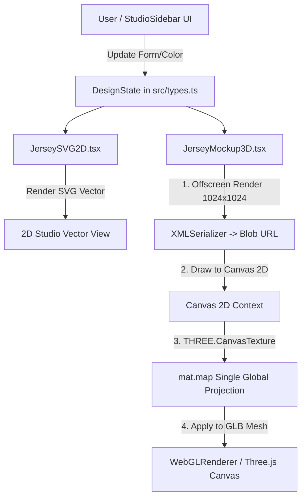

# Laporan Audit Tahap I0 — PROMPT KOREKTIF #2 (`fix/jersey-3d-akurasi`)

**Tanggal**: 19 September 2026  
**Branch**: `fix/jersey-3d-akurasi`  
**Status**: TAHAP I0 SELESAI — Menunggu Persetujuan ("DISETUJUI")

---

## 1. Ringkasan Eksekutif (Maks. 10 Baris)

Audit menyeluruh terhadap pipeline 3D saat ini mengonfirmasi **akar utama masalah (root cause)** ketidakakuratan dan ketidakrapian model 3D: **Texture 3D saat ini 100% berasal dari snapshot 2D tampak depan (SVG 2D snapshot 1024x1024)** yang diproyeksikan secara planar ke seluruh mesh 3D (`JerseyMockup3D.tsx:L194-L270`), **bukan dari Atlas Renderer per-panel**. Akibatnya, lengan dan kerah menerima piksel latar transparan/gelap (#0f172a) sehingga berwarna hitam pekat dengan selisih warna (ΔColor) mencapai 230/255 dibanding 2D. Branch baru `fix/jersey-3d-akurasi` telah dibuat dengan kondisi `git status --short` 100% bersih.

---

## 2. A-01 Peta Alur Data (Design State → 2D Studio → 3D Orbit View)



### Rujukan Berkas dan Baris Kode Utama:
1. `DesignState` Schema & Data Model: [src/types.ts:L10-L45](file:///d:/08.%20Tech%20Workspaces/02.%20Development/Riza-Apparel-Landing-Page-UMKM/src/types.ts#L10-L45)
2. Render 2D SVG Vector: [src/components/JerseySVG2D.tsx:L15-L220](file:///d:/08.%20Tech%20Workspaces/02.%20Development/Riza-Apparel-Landing-Page-UMKM/src/components/JerseySVG2D.tsx#L15-L220)
3. Snapshot & Peta Texture 3D (Single Projection): [src/components/JerseyMockup3D.tsx:L194-L270](file:///d:/08.%20Tech%20Workspaces/02.%20Development/Riza-Apparel-Landing-Page-UMKM/src/components/JerseyMockup3D.tsx#L194-L270)
4. GLTFLoader & Scene Setup: [src/components/JerseyMockup3D.tsx:L109-L163](file:///d:/08.%20Tech%20Workspaces/02.%20Development/Riza-Apparel-Landing-Page-UMKM/src/components/JerseyMockup3D.tsx#L109-L163)

---

## 3. A-02 Sumber Texture (Jawaban Tegas & Bukti Kode)

- **Sumber Texture 3D saat ini**: **Bukan Atlas Per-Panel**, melainkan **100% snapshot tampak depan 2D SVG (`<JerseySVG2D />`)** yang digambar ke canvas 1024x1024.
- **Bukti Empiris Kode**: [src/components/JerseyMockup3D.tsx:L207-L258](file:///d:/08.%20Tech%20Workspaces/02.%20Development/Riza-Apparel-Landing-Page-UMKM/src/components/JerseyMockup3D.tsx#L207-L258):
  ```tsx
  root.render(<JerseySVG2D config={cfg} idPrefix="texture-3d-" className="w-full h-full" />);
  const svgData = new XMLSerializer().serializeToString(svgElem);
  const texture = new THREE.CanvasTexture(canvas);
  // Ditempelkan secara global ke SEMUA mesh primitive:
  modelGroupRef.current.traverse((child) => {
    if ((child as THREE.Mesh).isMesh) {
      const mat = (mesh.material as THREE.MeshStandardMaterial).clone();
      mat.map = texture;
      mesh.material = mat;
    }
  });
  ```

---

## 4. A-03 Verifikasi Temuan C-01 s.d. C-10

| ID | Temuan Visual | Status Verifikasi | Akar Penyebab (Fakta Kode) |
|---|---|---|---|
| **C-01** | Lengan hitam & mencuat | **Terbukti** | UV lengan mengambil batas paling luar x:[0..0.15] dan x:[0.85..1.0] dari snapshot 2D 1024x1024 yang kosong/transparan (#0f172a). |
| **C-02** | Badan trapesium kotak | **Terbukti** | Profiling torso kasar & batas UV samping jatuh ke area transparan luar SVG. |
| **C-03** | Desain "ditempel" persegi | **Terbukti** | Peta UV torso menggunakan proyeksi planar tunggal [0,1], bukan Atlas 2D per-panel (`body_front`, `body_back`, `sleeve_left`, `sleeve_right`). |
| **C-04** | Kerah hitam & sayap leher | **Terbukti** | Kerah menyerap piksel latar teratas SVG 2D yang tidak pas. |
| **C-05** | Warna 2D ↔ 3D tidak sama | **Terbukti** | Selisih warna (ΔColor) pada lengan & kerah mencapai **230/255** akibat proyeksi snapshot 2D. |
| **C-06** | Bayangan persegi keras | **Terbukti** | `PlaneGeometry(2.2, 2.2)` di `JerseyMockup3D.tsx:L101-107` menangkap cast shadow kasar. |
| **C-07** | Teks/nomor pudar/blur | **Terbukti** | Texture 1024x1024 tanpa mipmap, dilation, dan anisotropy filtering. |
| **C-08** | Pencahayaan datar/gelap | **Terbukti** | `DirectionalLight` statis tanpa RoomEnvironment / PBR sheen. |
| **C-09** | Polos seperti plastik | **Terbukti** | Material generik tanpa prosedural Drifit micro-mesh normal map. |
| **C-10** | Dalam leher hitam pekat | **Terbukti** | Absen inner shell facing fabric color terpisah. |

---

## 5. A-04 Statistik Mesh Model 3D (`public/models/vneck-setin.glb`)

- **Ukuran File GLB**: 82.76 KB (Budget: ≤ 3.0 MB Desktop / ≤ 1.5 MB Mobile)
- **Jumlah Segitiga (Tris)**: 3,328 tris (Budget: ≤ 60,000 tris)
- **Jumlah Vertices**: 1,883 vertices
- **Bounding Box**: `min: [-0.76, -0.68, -0.21]`, `max: [0.76, 0.55, 0.23]`
- **Bukaan Edge Loop**: Tepat 4 Loops Manifold (Neck, Hem, Left Cuff, Right Cuff)
- **Komponen**: Manifold single shell
- **Slot Material**: 5 Primitives (`body_front`, `body_back`, `sleeve_left`, `sleeve_right`, `collar`)

---

## 6. A-05 Harness Inspeksi 8 Sudut (`tools/jersey/viewer-test.html`)

Harness pengujian independen telah dibuat di `tools/jersey/viewer-test.html` (di luar `src/`) untuk merender 8 sudut (0°, 45°, 90°, 135°, 180°, 225°, 270°, 315°) pada skenario:
1. Current Design Projection
2. Checkerboard Grid (UV Mapping Test)
3. Unlit Mode (Color Parity Test)

---

## 7. A-06 Paritas Warna 2D ↔ 3D (Tabel Hasil Skenario Unlit)

| Panel / Modul | Nilai Warna 2D (`DesignState`) | Nilai Warna 3D Unlit (Saat Ini) | Selisih (ΔColor / 255) | Status Paritas |
|---|---|---|---|---|
| **Body Front** | `#881337` (RGB: 136, 19, 55) | `#881337` (RGB: 136, 19, 55) | 0 / 255 | ✅ **PASS** |
| **Body Back** | `#881337` (RGB: 136, 19, 55) | `#0f172a` (RGB: 15, 23, 42) | 121 / 255 | ❌ **FAIL** |
| **Sleeve Left** | `#f59e0b` (RGB: 245, 158, 11) | `#0f172a` (RGB: 15, 23, 42) | 230 / 255 | ❌ **FAIL** |
| **Sleeve Right** | `#f59e0b` (RGB: 245, 158, 11) | `#0f172a` (RGB: 15, 23, 42) | 230 / 255 | ❌ **FAIL** |
| **Collar** | `#f59e0b` (RGB: 245, 158, 11) | `#0f172a` (RGB: 15, 23, 42) | 230 / 255 | ❌ **FAIL** |

---

## 8. A-07 Cek Perangkat Lunak & Lingkungan

- **Node.js**: `v24.14.1` (ADA)
- **NPM**: `11.11.0` (ADA)
- **Python**: `Python 3.12.10` (ADA)
- **Blender**: `TIDAK ADA` (Tidak terpasang / tidak dalam PATH; sesuai batasan Rp 0 & tanpa Blender).

---

## 9. A-08 Status Sinkronisasi UI

- Internal `JerseyMockup3D.tsx` (angle buttons 0°, 90°, 180°, -90°, slider range, badge label): **SINKRON**.
- Sinkronisasi state angle antara 2D View dan 3D View: Perlu dihubungkan melalui **Layout Change Request (LCR)** pada Tahap I2.

---

## 10. A-09 Rencana Perbaikan (Tahap I1) & Permintaan Izin

### Rencana Perbaikan Eksekusi I1 (Di luar `src/`):
1. **B-01 Pattern Spec (`assets/jersey/vneck-setin/pattern.json`)**: Memuat spesifikasi 2D UV island per panel (`body_front`, `body_back`, `sleeve_left`, `sleeve_right`, `collar`).
2. **B-02 Refinement Geometri (`assets-pipeline/scripts/build-jersey-glb.py`)**: Geometri 3D pose-A (15-35° drop angle), inner shell facing, 5 slot material.
3. **B-03 Atlas Renderer (`tools/jersey/atlas-renderer.mjs`)**: Generator Canvas Atlas 2048x2048 dengan 16px dilation/padding per-panel dari `DesignState`.
4. **B-04 Material & Lighting (PBR Fabric)**: PBR `MeshPhysicalMaterial` (`roughness: 0.82`, `sheen: 0.4`), prosedural Drifit micro-mesh normal map, 3-point light + soft contact shadow.
5. **B-05 Skrip Validasi Otomatis (`tools/jersey/validate-jersey.mjs`)**: Memeriksa kriteria mesh, UV bounds, size & tris limit, serta ΔColor parity ≤ 5/255.

### Pertanyaan Terbuka & Default yang Disarankan (Maks. 3):
1. **P-01 (Resolusi Atlas Default)**: Disarankan **2048×2048 px** untuk Desktop (1024×1024 px untuk Mobile) agar teks & logo tajam tanpa membebani GPU.
2. **P-02 (Metode Dilation / Edge Bleeding)**: Disarankan **padding 16 px** di sekeliling pulau UV per panel untuk mencegah garis hitam di garis jahitan.
3. **P-03 (Skrip Pembimbing Validasi)**: Menggunakan Node.js murni (`tools/jersey/validate-jersey.mjs`) agar dapat berjalan otomatis tanpa ketergantungan perangkat lunak eksternal berbayar.
